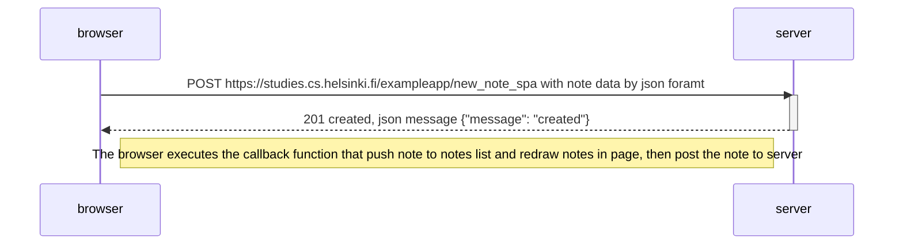

## New Note in single page app diagram

```mermaid
sequenceDiagram
    participant browser
    participant server

    browser->>server: POST https://studies.cs.helsinki.fi/exampleapp/new_note_spa with note data by json foramt
    activate server
    server-->>browser: 201 created, json message {"message": "created"}
    deactivate server
    
    Note right of browser: The browser executes the callback function that push note to notes list and redraw notes in page, then post the note to server 
```
